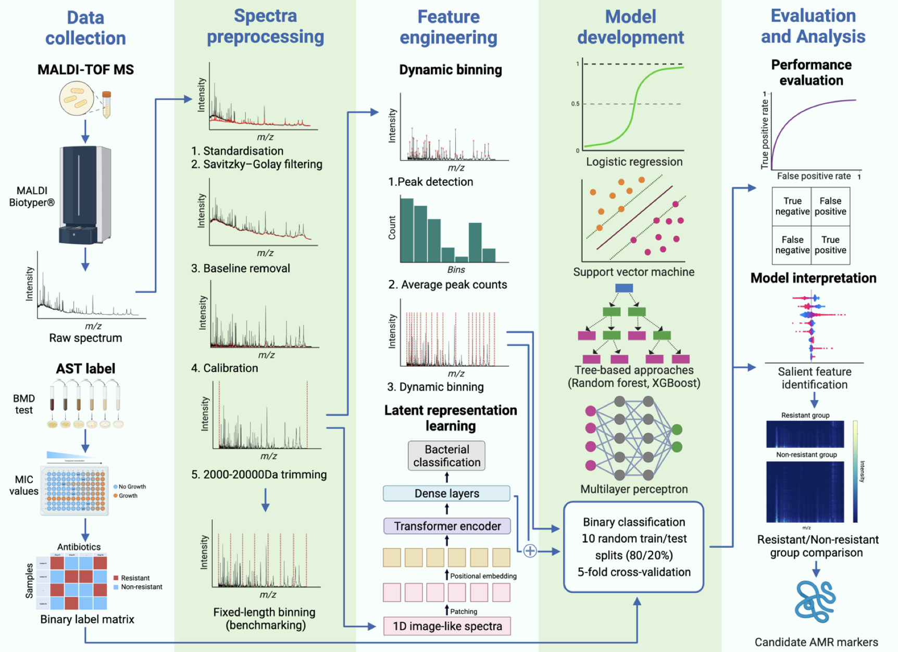

## Predicting Pseudomonas aeruginosa drug resistance using artificial intelligence and clinical MALDI-TOF mass spectra

This is the code repository of the [paper](https://www.biorxiv.org/content/early/2023/10/26/2023.10.25.563934)

### Abstract
Matrix-assisted laser desorption/ionization–time of flight mass spectrometry (MALDI-TOF MS) is widely used in clinical microbiology laboratories for bacterial identification but its use for detection of antimicrobial resistance (AMR) remains limited. Here, we used MALDI-TOF MS with artificial intelligence (AI) approaches to successfully predict AMR in Pseudomonas aeruginosa, a priority pathogen with complex AMR mechanisms. The highest performance was achieved for modern β-lactam/β-lactamase inhibitor drugs, namely ceftazidime/avibactam and ceftolozane/tazobactam. For these drugs, the model demonstrated area under the receiver operating characteristic curve (AUROC) of 0.869 and 0.856, specificity of 0.925 and 0.897, sensitivity of 0.731 and 0.714, respectively. As part of this work, we developed dynamic binning, a feature engineering technique that effectively reduces the high-dimensional feature set and has wide-ranging applicability to MALDI-TOF MS data. Compared to conventional feature engineering approaches, the dynamic binning method yielded better performance in 7 of 10 antimicrobials. Moreover, we showcased the efficacy of transfer learning in enhancing the AUROC performance for 8 of 11 antimicrobials. By assessing the contribution of features to the model’s prediction, we identified proteins that may contribute to AMR mechanisms. Our findings demonstrate the potential of combining AI with MALDI-TOF MS as a rapid AMR diagnostic tool for Pseudomonas aeruginosa.

### Workflow


### System requirements and Installation

Create conda environment

```
conda env create -f envs/maldi_amr.yml
```

Activate conda environment

```
conda activate maldi_amr
```

### Spectra preprocessing

To run this preprocessing pipeline, please extract your raw spectra to csv file with the first column contains mass (m/z) values and the second column contains the corresponding intensity values. The script will search for all spectra files (.txt extension) in the specified input directory.  
**IMPORTANT**: Please do not include headers or you need to use the skiprows option.

```
cd src/preprocess
python preprocess.py ${INPUT_DIR} ${OUTPUT_DIR}
```

**Arguments**  
--binned_output_dir: create 1-Da binning files  
--delimiter: specify delimiter other than comma  
--skiprows: skip metadata rows (if needed)

### Dynamic binning profile generation

```
cd src/preprocess
python get_bins.py ${AVERAGE_PEAK_COUNT_FILE} ${BINNING_TYPE} ${OUTPUT_PATH}
```

`${BINNING_TYPE} = 'dynamic'` for dynamic binning. Please refer to the Methods section for instructions on generating the `${AVERAGE_PEAK_COUNT_FILE}`. The data is structured as a table, with rows representing isolates and columns displaying the average peak count for each region. The script also supports creating fixed-length binning by specifying the bin size argument, e.g., `--bin_size 3` for 3-Da binning

### AMR prediction

```
cd src
python src/predict.py ${CONFIG_PATH} ${ANTIMICROBIAL} ${MODEL}
```

Example of config file and the corresponding input files can be found [here](./examples/prediction). Antimicrobial should be aligned with columns in [susceptibility testing file](./examples/prediction/ast_data.csv). Model list includes logistic regression ('LR'), random forest ('RF'), support vector machine ('SVM'), LighGBM ('LGB'), and multi-layer perceptron ('MLP').

### Load pretrained weight
The instruction to load the pretrained weight for ViT model can be found [here](./ViT/pretrained_vit.ipynb)

### Citation
```
@article{Nguyen2023.10.25.563934,
	author = {Hoai-An Nguyen and Anton Y Peleg and Jiangning Song and Bhavna Antony and Geoffrey I Webb and Jessica A Wisniewski and Luke V Blakeway and Gnei Z Badoordeen and Ravali Theegala and Helen Zisis and David L Dowe and Nenad Macesic},
	doi = {10.1101/2023.10.25.563934},
	journal = {bioRxiv},
	title = {Predicting Pseudomonas aeruginosa drug resistance using artificial intelligence and clinical MALDI-TOF mass spectra},
	url = {https://www.biorxiv.org/content/early/2023/10/26/2023.10.25.563934},
	year = {2023}}
```

